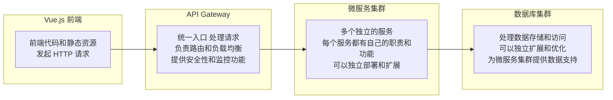

 [[2023-03-20-星期一]]  #🌱发芽 
 
开发一个前端基于 Vue 后端使用 Go 开发的 Web 应用程序，采用前后端分离，将前端和后端分别开发，通过 API 进行数据交互。
## 前端 ：
前端采用 `Vue. js` 框架进行开发，可以使用 `Vue CLI `创建项目，使用 `Vue Router` 进行路由管理，使用 `Vuex` 进行状态管理，使用 `axios` 进行 HTTP 请求。

在前后端分离的架构中，前端应用程序通过HTTP请求向后端服务器请求数据。后端服务器应该提供`RESTful API`，以便前端可以轻松地与后端通信。

## 后端 ：
后端采用 GO 语言开发，可以使用 ==Gin== 框架进行 Web 开发。
实现前后端分离需要考虑如何进行前后端的通信，如何定义**数据接口**。
为了实现微服务，可以将不同的功能模块拆分成独立的服务，每个服务都有自己的 API 接口，可以使用 ==gRPC== 进行服务之间的通信。

## 数据库 ：
选择 ==MySQL== 数据库，可以使用 ==GORM== 或 XORM 等 ORM 框架进行数据访问和操作。

综上所述，整体的架构设计如下：

> Vue. js 前端 ---> API Gateway ---> 微服务集群 ---> 数据库集群

其中，API Gateway 可以使用 Kong 或 Nginx 等开源工具。微服务集群可以使用 Kubernetes 进行部署和管理，数据库集群可以使用 MySQL 或 PostgreSQL 进行部署和管理。
在开发过程中，可以使用 Git 进行版本控制。

